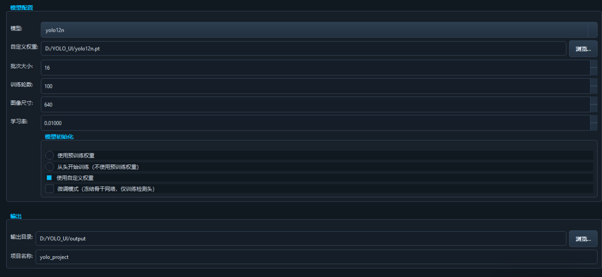
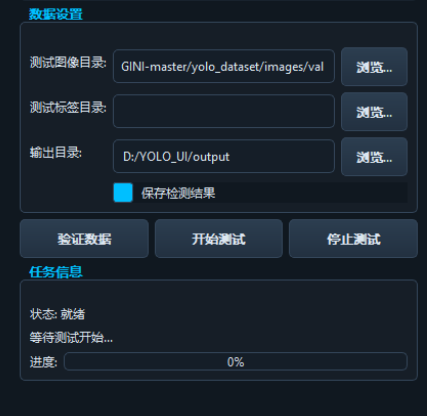
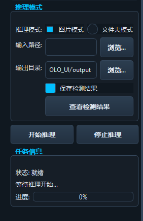
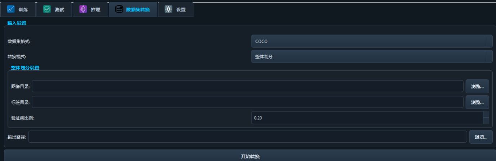

## 📋 功能概览

YOLO目标检测训练与测试工具是一个基于Qt5的现代化图形用户界面应用程序，提供了使用YOLOv8、YOLOv5和YOLO11系列模型进行目标检测的完整解决方案。

### 🎯 核心特性

- 🔄 支持多种YOLO模型系列（YOLOv8/v5/11/12）
- 💻 现代化图形界面，支持多主题切换
- 🚄 GPU加速支持，实时训练监控
- 📊 实时可视化检测结果
- 🛠️ 灵活的数据集格式转换工具

## 🌟 主要功能

### 1. 🎓 模型训练

点击展开详情

- **数据集管理**：支持YOLO格式的数据集，包括训练和验证数据集的设置
- **模型选择**：支持多种YOLO模型（YOLOv8、YOLOv5、YOLO11、YOLO12系列）
- **初始化选项**：
  - ✨ 使用预训练权重
  - 🆕 从头开始训练
  - 📥 使用自定义权重
- **微调模式**：支持冻结骨干网络，仅训练检测头
- **超参数设置**：
  - 📦 批次大小
  - 🔄 训练轮数
  - 📐 图像尺寸
  - 📈 学习率
- **训练进度监控**：实时进度条和日志输出
- 

### 2. 📊 模型测试

点击展开详情

- **模型评估**：对训练好的模型进行精度评估
- **测试数据设置**：指定测试图像和标签目录
- **参数配置**：
  - 🎯 置信度阈值
  - 🔍 IoU阈值
  - 📏 图像尺寸
- **实时结果预览**：显示检测结果图像
- **结果保存**：将测试结果保存到指定目录
- **终端日志**：实时输出测试进度和结果!
- 

### 3. 🔍 模型推理

点击展开详情

- **推理模式**：
  - 📸 单张图片推理
  - 📁 文件夹批量推理
- **参数设置**：
  - 🎯 置信度阈值
  - 🔍 IoU阈值
  - 📏 图像尺寸
- **结果展示**：实时预览检测结果
- **图像浏览器**：查看和浏览所有生成的结果图像
- **结果保存**：将推理结果保存到指定目录
- 

### 4. 🔄 数据集转换

点击展开详情

- **支持格式**：COCO和VOC格式转换为YOLO格式
- **转换模式**：
  - 🔄 整体划分：自动划分训练集和验证集
  - ✂️ 指定训练/验证集：手动指定训练和验证数据
- **验证集比例**：可自定义设置验证集占比
- **输出**：生成符合YOLO标准的数据集，包括images、labels和dataset.yaml

